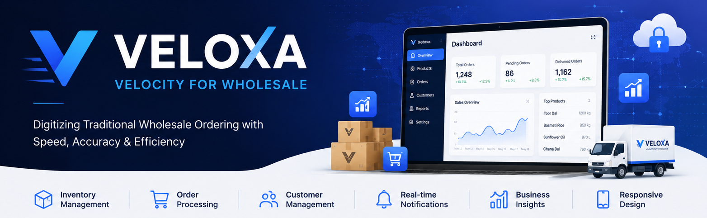
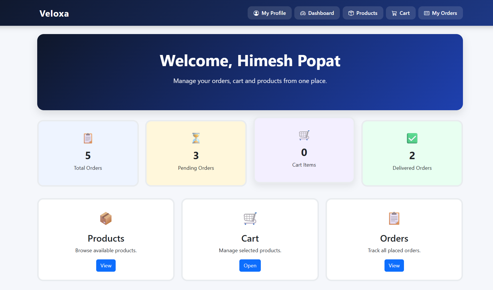
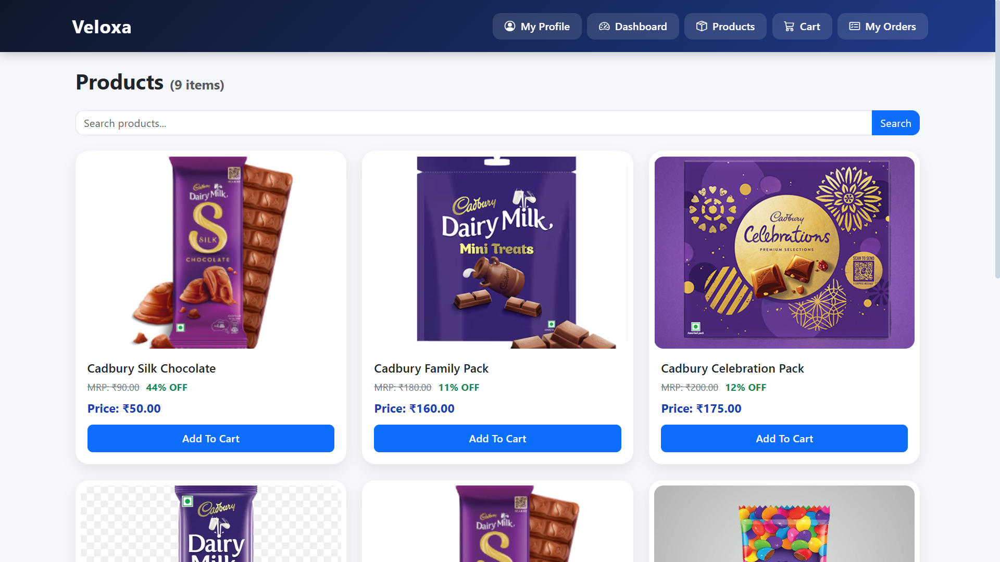
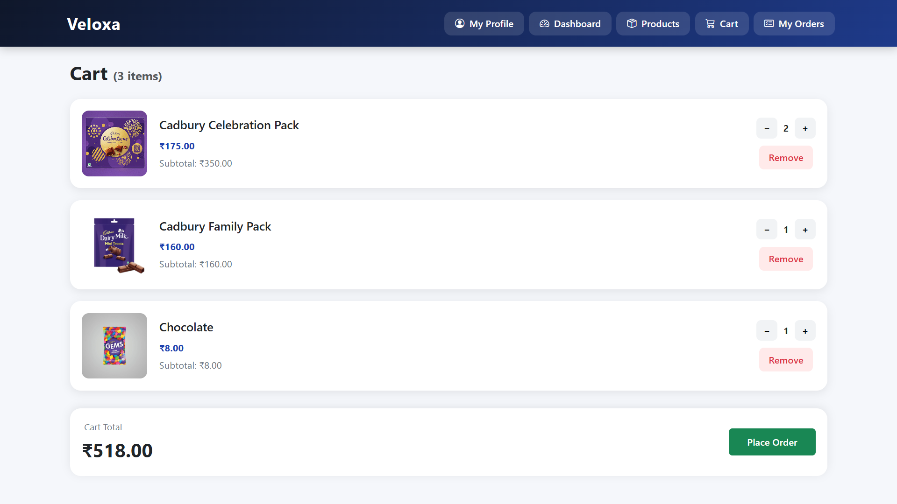
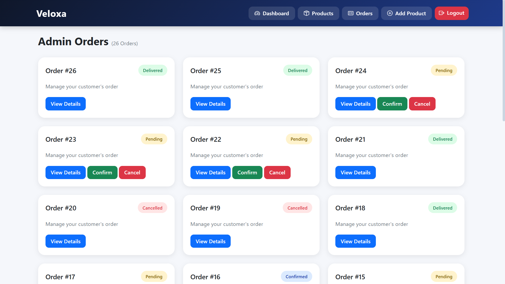
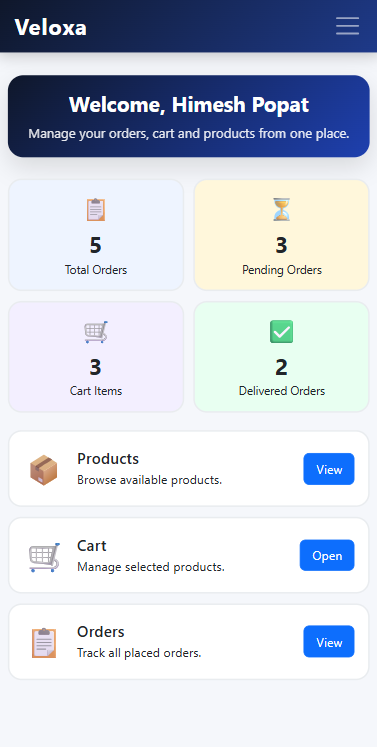
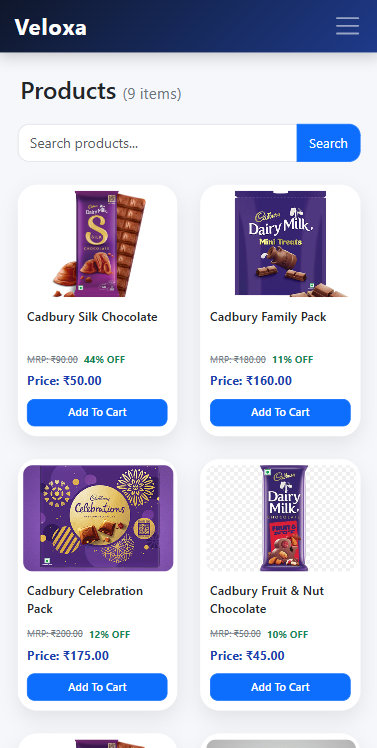
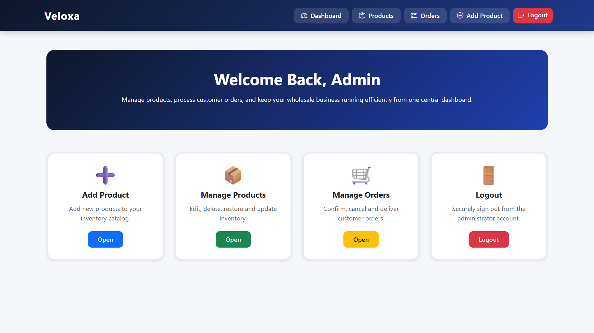
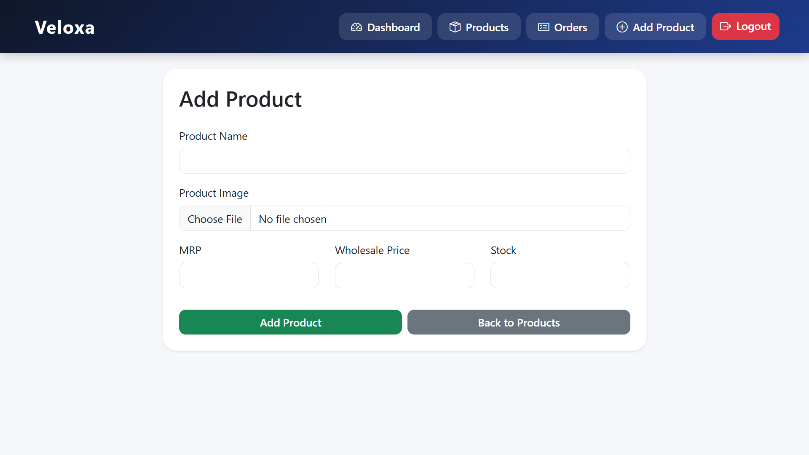
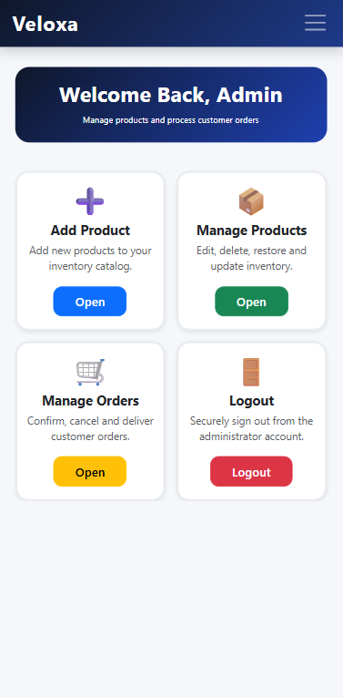

<p align="center">
  
</p>

<br>

# 🚀 Veloxa — Velocity for Wholesale

<p align="center">
  <b>A full-stack B2B commerce platform that digitizes traditional wholesale ordering through secure authentication, inventory management, and automated order processing.</b>
</p>

<p align="center">
  
  
  
  
  
  
  
  
  
  
  
</p>

---

## 📑 Table of Contents

- [Overview](#-overview)
- [Project at a Glance](#-project-at-a-glance)
- [Motivation](#-motivation)
- [Business Impact](#-business-impact)
- [Features](#-features)
- [Order Workflow](#-order-workflow)
- [Tech Stack](#-tech-stack)
- [Architecture](#architecture)
- [Key Highlights](#-key-highlights)
- [Application Screenshots](#-application-screenshots)
- [Project Demo](#-project-demo)
- [Project Structure](#-project-structure)
- [Installation](#-installation)
- [Security Features](#-security-features)
- [Future Enhancements](#-future-enhancements)
- [License](#-license)
- [Author](#-author)

---

## 📖 Overview

**Veloxa** is a full-stack web application designed to modernize the traditional wholesale ordering process through a centralized B2B commerce platform. Small and mid-sized wholesale businesses often rely on field representatives to travel from shop to shop collecting orders manually from retailers. These orders are then communicated through phone calls, WhatsApp messages, or handwritten registers. While this traditional workflow has worked for years, it is time-consuming, difficult to scale, prone to communication errors and often results in inventory mismatches.

**Veloxa** replaces this process with a centralized digital platform where retailers can independently browse products, place orders, and track purchases online, while administrators efficiently manage inventory, customers, and the complete order lifecycle from a single dashboard.

---

## 📊 Project at a Glance

- 👥 Supports 100+ Registered Customers
- 👤 2 User Roles (Customer & Admin)
- 🔄 3-Stage Order Workflow
- 📄 Professional PDF Invoice Generation for Both Customers & Admins
- ☁️ Cloud Integrations (Cloudinary & Brevo)
- 📱 Responsive Desktop & Mobile UI
- 🚀 Production Deployment on Render

---

## 💡 Motivation

Traditional wholesale distribution relies heavily on field agents who visit shops, manually note down orders, and relay them back to the office, a workflow that is slow, error-prone, and hard to audit. Veloxa digitizes that relationship: retailers place their own orders directly, admins process them from one screen, and every order carries a full, timestamped history instead of a slip of paper.

---

## 💼 Business Impact

Veloxa replaces manual order collection with a centralized digital platform, enabling wholesalers to reduce paperwork, improve inventory accuracy, streamline order processing, and provide retailers with a faster, more convenient ordering experience.

---

## ✨ Features

### 🔐 Authentication & Security

- Email OTP verification during registration
- Secure password hashing using Werkzeug
- Session-based authentication
- CSRF protection for all POST requests
- Route-based rate limiting using Flask-Limiter
- Session fixation protection

### 👤 Customer Features

- Register and log in securely
- Browse and search products
- Add products to cart
- Modify cart quantities
- Place wholesale orders
- Edit or cancel pending orders
- View complete order history
- Download PDF invoices
- Manage profile information

### 🛠️ Admin Features

- Secure admin login
- Dashboard with order overview
- Add, edit, soft-delete and restore products
- Manage customer orders
- Confirm, cancel and deliver orders
- Automatic stock deduction on order confirmation
- Product search and pagination

---

## 🔄 Order Workflow

```text
Customer                          Admin
   │                                │
   ▼                                │
Browse Products                     │
   │                                │
   ▼                                │
Add to Cart                         │
   │                                │
   ▼                                │
Place Order  ───────────────────►  Pending
                                     │
                        ┌────────────┴────────────┐
                        ▼                          ▼
                    Confirmed                  Cancelled
                (stock deducted)         (by admin or customer,
                        │                  only while Pending)
                        ▼
                    Delivered
```

Customers can edit or cancel an order only while it is `Pending`. Once an admin confirms it, stock is deducted and the order moves forward to `Delivered`.

---

## 🛠 Tech Stack

| Category | Technologies |
|-----------|--------------|
| **Frontend** | HTML5, CSS3, Bootstrap 5, Jinja2 |
| **Backend** | Python, Flask, SQLAlchemy |
| **Database** | SQLite (Development), PostgreSQL (Production) |
| **Authentication** | Session-Based Authentication, Email OTP |
| **Email Service** | Brevo |
| **Image Storage** | Cloudinary |
| **PDF Generation** | ReportLab |
| **Security** | Flask-WTF, Flask-Limiter, Werkzeug |
| **Deployment** | Render |

---

## 🏗️ Architecture

Veloxa follows a **modular Blueprint-based architecture** that separates authentication, customer operations, order management, and administration into independent modules.

```text
routes/
├── auth.py          # Authentication & OTP
├── customer.py      # Customer dashboard & profile
├── orders.py        # Cart & order management
├── admin.py         # Admin dashboard & product management
├── helpers.py       # Shared helper functions
└── extensions.py    # Flask extensions
```

This modular structure improves maintainability, readability, scalability, and reduces code duplication by keeping related functionality logically organized.

---

## 🗄️ Database Design

Veloxa uses a relational database designed around the wholesale ordering workflow.

| Model | Purpose |
|-------|---------|
| **Customer** | Stores customer account and shop information. |
| **Admin** | Stores administrator login credentials. |
| **Product** | Maintains product catalog, pricing, stock, and availability. |
| **Cart** | Temporarily stores products before checkout. |
| **Order** | Stores order details and current order status. |
| **OrderItem** | Stores individual products associated with each order. |

---

## ⭐ Key Highlights

* 🔐 Email OTP-verified registration flow
* 📦 Real-time inventory validation — orders can never exceed available stock
* 🛒 Full cart → checkout → order-lifecycle pipeline
* 📧 Automated email notifications on new orders and OTPs
* 🧾 Editable pending orders with per-item add/remove/adjust controls
* 🧾 Professional PDF invoice generation for customers and administrators
* 🗑️ Soft-delete/restore for products instead of destructive deletes
* 📱 Responsive UI, verified on both desktop and mobile
* 🧱 Clean route-level access control separating customer and admin sessions
* 🧩 Modular Blueprint-based Flask architecture

---

## 📸 Application Screenshots

The following screenshots showcase the customer and administrator interfaces across desktop and mobile devices.

### Customer Experience

| Dashboard | Products |
|---|---|
|  |  |

| Cart | Orders |
|---|---|
|  |  |

**Mobile View**

| Dashboard | Products |
|---|---|
|  |  |

### Admin Experience

| Admin Dashboard | Add Product |
|---|---|
|  |  |

**Mobile View**



---

## 🎥 Project Demo

Watch a complete walkthrough of Veloxa showcasing customer registration, order placement, admin management, and the overall workflow.

▶️ **[Watch Demo Video](https://drive.google.com/file/d/1YtrFeUnOcULB42dMl4MQb3Z9Ywd7UxNh/view?usp=sharing)**

---

## 🌐 Live Demo

Experience the deployed application here:

🔗 **https://veloxa-kla4.onrender.com**

---

## 📂 Project Structure

```
Veloxa/
│
├── app.py
├── models.py
├── routes/
│   ├── auth.py
│   ├── customer.py
│   ├── orders.py
│   ├── admin.py
│   ├── helpers.py
│   └── extensions.py
│
├── static/
├── templates/
├── assets/
├── utils/
│   └── invoice_generator.py
├── instance/
├── .gitignore
├── requirements.txt
└── README.md
```

---

## 🚀 Installation

**1. Clone the repository**
```bash
git clone https://github.com/Himeshpopat/Veloxa.git
cd Veloxa
```

**2. Create and activate a virtual environment**
```bash
python -m venv venv

# Windows
venv\Scripts\activate

# Linux / macOS
source venv/bin/activate
```

**3. Install dependencies**
```bash
pip install -r requirements.txt
```

**4. Configure environment variables**

Create a `.env` file in the project root:
```env
SECRET_KEY=your_secret_key
DATABASE_URL=your_postgresql_connection_string
BREVO_API_KEY=your_brevo_api_key
CLOUDINARY_CLOUD_NAME=your_cloud_name
CLOUDINARY_API_KEY=your_api_key
CLOUDINARY_API_SECRET=your_cloudinary_api_secret
SESSION_COOKIE_SECURE=false
```

**5. Configure invoice settings**

Open `utils/invoice_generator.py` and replace the placeholder business information with your own details.

- Company / Shop Name
- Address
- Contact Number
- Email Address
- Payment Terms (optional)

Example:

```python
# Company Information
"Admin's Shop Name"
"Address Line 1"
"Address Line 2"
"Contact No.: XXXXXXXXXX"
"Email: xyz@gmail.com"

# Footer
"Payment Due: X Days"
```

These values are displayed on every generated PDF invoice for both customers and administrators.

**6. Run the application**
```bash
python app.py
```
The app will be available at `http://127.0.0.1:5000`.

---

## 🔐 Security Features

* Passwords hashed with Werkzeug — never stored in plaintext
* OTP-gated registration with a 5-minute expiry window and rate-limited resend
* Session fixation prevention (`session.clear()` + regeneration on every login)
* HTTP-only, SameSite session cookies with an environment-configurable `Secure` flag
* Rate limiting on login, registration, and OTP routes via Flask-Limiter
* Strict server-side ownership checks on carts, orders, and order edits
* File-upload validation — extension whitelisting plus path-traversal protection on saved images
* Centralized error handling with dedicated 403 / 404 / 500 pages and server-side exception logging

---

## 📈 Future Enhancements

* 💳 Payment Gateway Integration
* 📊 Sales Analytics Dashboard
* 🐘 Full PostgreSQL Production Support
* 🤖 AI-based Demand Forecasting
* 📱 Progressive Web App (PWA)

---

## 📄 License

This project is developed for educational, portfolio, and learning purposes.

You are welcome to explore the code, learn from it, and adapt it for personal or academic use.

---

## 👨‍💻 Author

**Himesh Popat**

📧 Email: [himeshpopat2006@gmail.com](mailto:himeshpopat2006@gmail.com)

🔗 LinkedIn: https://linkedin.com/in/himesh-popat

💻 GitHub: https://github.com/Himeshpopat

---

## ⭐ Support

If this project was useful to you, consider giving it a **star** — it helps others discover it and supports future improvements.

---

> Built using Flask, SQLAlchemy, and Bootstrap to simplify wholesale order management through a secure, scalable, and user-friendly web application.